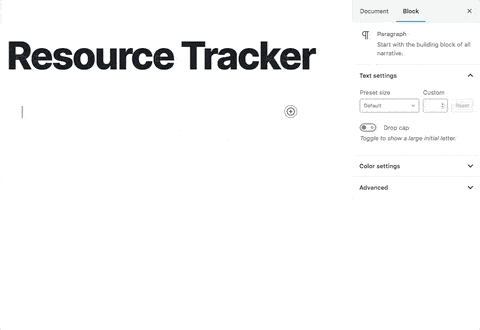
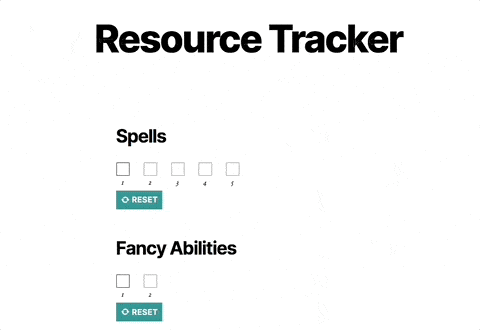

# Resource Tracker #

## Description ##
This plugin provides the Resource Tracker block, which can be used to track usage of limited resources (e.g., abilities, spells) in Table-Top Role-Playing Games.

Built with [WDS Block Starter](https://github.com/WebDevStudios/wds-block-starter).

## Installation ##

1. Upload the `resource-tracker` folder to the `/wp-content/plugins` directory.
2. Activate the Resource Tracker plugin through the 'Plugins' menu in WordPress.
3. Add the 'Resource Tracker' block in a post or page.
4. Set the Resource name and total uses available.
5. Save and view your page or post.
6. Use the Resource's checkboxes to track usage.
7. Use the Reset button to reset usage back to 0.

## Frequently Asked Questions ##

### How should I use this block? ###
Use this block to track fixed-usage resources, such as spells or special abilities. Click a checkbox to mark one use, until all uses are gone! Then, you can click Reset to regain full usage of the resource, e.g., after a rest.

### How can I report issues or suggest improvements? ###
Feel free to create an issue or PR in the [Github repo here](https://github.com/ravewebdev/resource-tracker).

## Screenshots ##

### Admin Demo ###

### Frontend Demo ###

## Changelog ##

### 1.1.2 ###
* Fixed: Removed duplicate block wrapper `div` on frontend display.

### 1.1.1 ###
* Fixed: Changed checkbox mark color to inherit current text color for better accessibility.

### 1.1.0 ###
* Added: Implemented permissions check callback for custom route.
* Updated: Cleaned up code, comments to be more in line with similar blocks (e.g., Initiative Tracker).
* Updated: Changed checkbox wrapper tag from `p` to `div`.
* Fixed: Changed block ID to update only at creation to avoid false-positive post "changes."
* Fixed: Added key prop to checkboxes to address React warnings.

### 1.0.0 ###
Added: Create Resource Tracker block.
